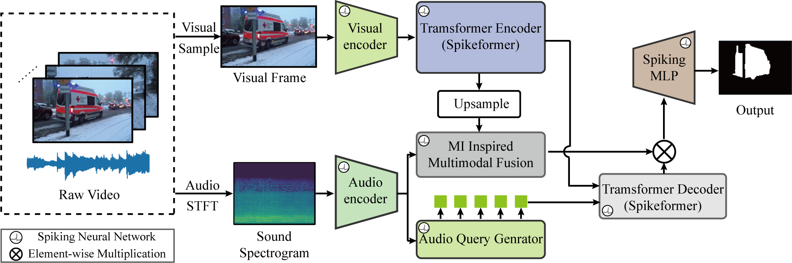

# Mutual-information-improved-audio-visual-segmentation-using-spiking-neural-networks
Audio-visual segmentation (AVS) seeks to localize sounding objects in video sequences by modeling the semantic correspondence between auditory and visual signals. Existing methods often over-rely on a single modality and struggle to capture cross-modal dependencies, leading to incomplete or redundant information and limiting performance in complex scenarios. We propose a mutual information-enhanced AVS framework that explicitly models statistical dependencies between modalities to improve visual feature representation. Unlike prior approaches that estimate mutual information between network inputs and outputs, our method leverages Mutual Information Neural Estimation to capture fine-grained cross-modal interactions between audio and visual features. Experiments on the AVSBench dataset demonstrate that our approach achieves competitive performance, with a 2.2\% improvement in mean Intersection over Union over state-of-the-art methods in single-source settings. Additionally, we introduce a spiking neural network variant, reducing energy consumption by 80.4\% with only a 6.6\% mIoU degradation, enabling efficient deployment in resource-constrained environments.

## 🏠 Method


## 🛠️ Get Started
### 1. Environments
```shell
# recommended
pip install torch==1.10.0+cu111 torchvision==0.11.0+cu111 torchaudio==0.10.0 -f https://download.pytorch.org/whl/torch_stable.html
pip install mmcv-full -f https://download.openmmlab.com/mmcv/dist/cu111/torch1.10.0/index.html
pip install pandas
pip install timm
pip install resampy
pip install soundfile
# build MSDeformAttention
cd ops
sh make.sh
```
### 2. Data
Please refer to the link [AVSBenchmark](https://github.com/OpenNLPLab/AVSBench) to download the datasets. You can put the data under `data` folder or rename your own folder. Remember to modify the path in config files. The `data` directory is as bellow:
```
|--data
   |--AVSS
   |--Multi-sources
   |--Single-source
```
### 3. Train
```shell
TASK = "s4"  # or ms3, avss
CONFIG = "config/s4/AVSegFormer_pvt2_s4.py"

bash train.sh ${TASK} ${CONFIG}
```
### 4. Test
```shell
TASK = "s4"  # or ms3, avss
CONFIG = "config/s4/AVSegFormer_pvt2_s4.py"
CHECKPOINT = "work_dir/AVSegFormer_pvt2_s4/S4_best.pth"

bash test.sh ${TASK} ${CONFIG} ${CHECKPOINT}
```
